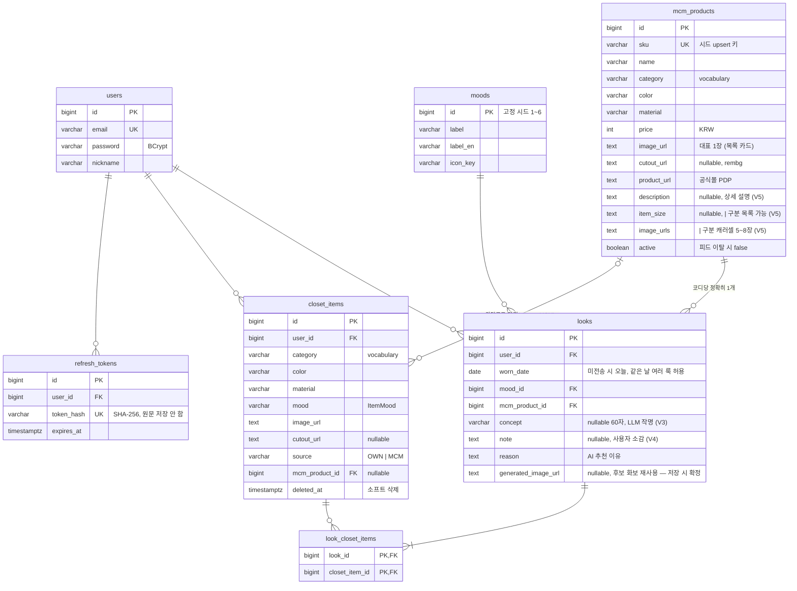

# ERD — MCM MUSE v1

> 물리 스키마의 기준은 Flyway 마이그레이션(`src/main/resources/db/migration/`).
> 이 문서는 그걸 그림으로 보는 용도 + 설계 결정 요약. 규칙은 [`conventions/DB-컨벤션.md`](conventions/DB-컨벤션.md).

(공통 컬럼 `created_at`/`updated_at`은 그림에서 생략)

## transient — 테이블이 없는 것들

`StyleDna` · `Recommendation` · `Outfit`(코디 후보)은 **매 호출 생성·미저장**(계약 Q9). DTO로만 존재한다.
저장되는 건 사용자가 택1한 `Look`뿐.

## 설계 결정 요약

| 결정 | 내용 | 이유 |
|---|---|---|
| Look↔아이템 = 관계 테이블+FK | `look_closet_items` | 무결성 DB 보장, "이 옷 들어간 룩" 역질의 |
| 옷장 소프트 삭제 | `deleted_at` | 옷을 버려도 과거 코디 기록·콜라주 보존 |
| vocabulary = varchar+앱검증 | DB enum 안 씀 | AI가 채우는 필드라 값 확장이 잦음 — enum 수정만으로 끝 |
| `occasion_label` 저장 안 함 | moods 조인으로 조립 | 무드 시드가 아직 Figma 정렬 대기 — 라벨 바뀌면 조인이 알아서 반영 |
| refresh token DB 저장+회전 | `refresh_tokens` | 로그아웃이 서버에서 실제로 토큰을 무효화 |
| 상품 재적재 = upsert+active | `sku` UNIQUE, row 삭제 금지 | 옷장·룩 FK 보존, 적재 재실행 안전(멱등) |
| 긴 텍스트 = `text` | `description`·`note`·`item_size` | Postgres에서 `text`≡`varchar(n)` 성능 동일(TOAST) — 길이 제약은 도메인 규칙일 때만 DB에, 아니면 API 검증(@Size)으로. `item_size`는 varchar(40)로 잡았다가 신발 사이즈 목록 140자 실측으로 교정 |
| `image_urls` = 파이프 text (비정규화) | `AttributeConverter`로 `List<String>` 캡슐화 | 개별 이미지 질의·수정 API가 없고 항상 통째 교체(시드 upsert) — 관계 테이블은 조인·컬렉션 upsert 복잡도만 추가. URL엔 `\|` 불가라 안전. 개별 질의가 필요해지면 그때 V(n)으로 정규화 |

## 주요 쿼리 ↔ 인덱스

| 쿼리 | 인덱스 |
|---|---|
| `GET /closet-items` (유저별, createdAt DESC, 활성만) | `idx_closet_items_user_active` (부분 인덱스, `WHERE deleted_at IS NULL`) |
| `GET /mcm-products` (active, 카테고리) | `idx_mcm_products_active_category` |
| `GET /looks?month=` (유저별 기간) | `idx_looks_user_worn_date` |
| refresh 검증 (해시 lookup) | `uq_refresh_tokens_token_hash` |
| 시드 upsert | `uq_mcm_products_sku` |
